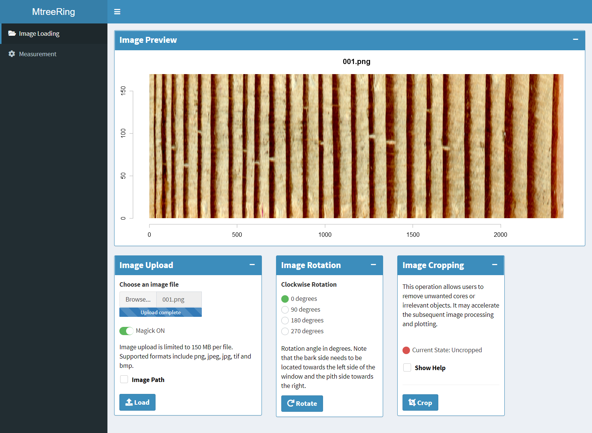

MtreeRing
=======

<!--require(knitr);require(markdown);knit("README.Rmd")-->


**Authors:** [Jingning Shi](https://www.researchgate.net/profile/Jingning_Shi), [Wei Xiang](https://www.researchgate.net/profile/Wei_Xiang15)<br/>
**License:** [GPL3](https://cran.r-project.org/web/licenses/GPL-3)

<!--pkg badges-->
[](https://travis-ci.org/ropensci/MtreeRing.svg?branch=master)
[](https://ci.appveyor.com/project/ropensci/MtreeRing/branch/master)
[](https://codecov.io/gh/ropensci/MtreeRing)
[](https://github.com/ropensci/software-review/issues/287)
[](https://cranchecks.info/pkgs/MtreeRing)
[](https://CRAN.R-project.org/package=MtreeRing)

`MtreeRing` is a tool for automatically measuring tree-ring width using image processing techniques.

## Installation

Install the stable version from CRAN


```r
install.packages("MtreeRing")
```

or the development version from GitHub


```r
# install.packages("devtools")
devtools::install_github("JingningShi/MtreeRing")
```

## Ring-width measurement

### 1. Read an image


```r
library(MtreeRing)
## Read and plot a tree ring image
img.name <- system.file("001.png", package = "MtreeRing")
t1 <- ring_read(img = img.name, dpi = 1200, plot = TRUE)
```

`ring_read` supports commonly used image formats, including png, tiff, jpg and bmp.

### 2. Detect ring borders 

After plotting the image, the automatic detection of ring borders can be performed using three alternative methods: (1) watershed algorithm; (2) Canny edge detector; (3) a linear detection algorithm from R package [measuRing](https://CRAN.R-project.org/package=measuRing).


```r
## Split a long core sample into 2 pieces to
## get better display performance and use the
## watershed algorithm to detect ring borders:
t2 <- ring_detect(ring.data = t1, seg = 2, method = 'watershed')
```

<center></center>
<center>Figure 1. The automatic detection of ring borders</center>

### 3. Calculate ring-width series 

If all ring borders are correctly identified, you can generate a ring-width series in data frame format. Use `write.rwl` to export the ring-width series to an rwl file.


```r
rw.df <- ring_calculate(ring.data = t2, seriesID = "940220")
library(dplR) # A dendrochronological analysis package
fn <- tempfile(fileext=".rwl")
write.rwl(rwl.df = rw.df, fname = fn, format = "tucson")
```


## Shiny application

If you are not familiar with R and its command line interface, the shiny-based app is a good alternative.


```r
MtreeRing::ring_app_launch()
```

This command allows to run a Shiny-based application within the system's default web browser. The app provides a beginner-friendly graphical interface and supports more flexible mouse-based interactions.

The dashboard has three components: a header, sidebar and body, like this



A workflow for the Shiny app can be found in the package vignette. Most steps are demonstrated with a gif to make the workflow more understandable.


```r
vignette('app-MtreeRing')
```

## Ring width correction

If an increment borer is used to extract samples, it is well known that the auger sometimes fails to traverse the pith of the sampled tree but passes through one side of the pith at a certain distance. Tangent lines of rings close to the pith are therefore not perpendicular to the horizontal path, which may lead to considerable errors in ring widths.

Under such conditions, you can create two paths by setting the argument `incline = TRUE`, or by ticking the checkbox "**Inclined tree rings**". See this example.

 

The line segment connecting two dots on the same ring should match the tangent of a tree ring border. The corrected ring width is estimated from the distance between adjacent rings and orientation of ring borders.

## Code of conduct

Please note that the 'MtreeRing' project is released with a [Contributor Code of Conduct](CODE_OF_CONDUCT.md). By contributing to this project, you agree to abide by its terms.

[](https://ropensci.org)
