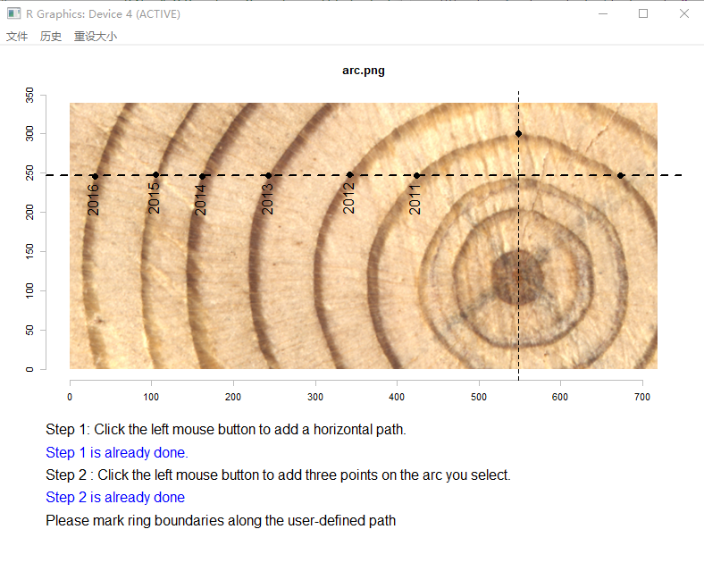

<!--require(knitr);require(markdown);knit("MtreeRing_vignette.Rmd")-->

`MtreeRing` is a tool for automatically measuring tree-ring width using image processing techniques.

## 1. Read and plot a tree ring image

```{r}
library(MtreeRing)
img.name <- system.file("001.png", package = "MtreeRing")
t1 <- imgInput(img = img.name, dpi = 1200)
```

`imgInput` supports commonly used image formats and returns a magick image object.


## 2. Detect ring borders 

After plotting the image, the automatic detection of ring borders can be performed using three alternative methods: (1) watershed algorithm; (2) Canny edge detector; (3) a linear detection algorithm from R package [measuRing](https://CRAN.R-project.org/package=measuRing).

If `auto.path = TRUE`, the function will create a path at the center of the image. In the current version, the path is a horizontal dashed line. Detected ring borders are placed along the path, and are tagged with years and border numbers.

```{r eval=FALSE}
## Split a long core sample into 2 pieces to
## get better display performance and use the
## watershed algorithm to detect ring borders:
t2 <- autoDetect(ring.data = t1, auto.path = TRUE, seg = 2, method = 'watershed')
```


For increment cores with inclined rings, you can create two paths by setting `incline = TRUE`. The distance between adjacent rings and orientation of ring borders are used to correct the ring-width series.

```{r eval=FALSE}
img.name <- system.file("incline.png", package = "MtreeRing")
t1 <- imgInput(img = img.name, dpi = 1200)
t2 <- autoDetect(ring.data = t1, incline = TRUE, method = 'watershed')
```


## 3. Edit tree rings

You can manually add (remove) tree ring borders to (from) the image using the function `visualSelect`.

### 3.1 Remove tree rings

Assume that ring borders 1, 3, 5 were falsely identified as transitions between earlywood and latewood.

```{r eval=FALSE}
img.name <- system.file("001.png", package = "MtreeRing")
t1 <- imgInput(img = img.name, dpi = 1200)
t2 <- autoDetect(ring.data = t1, auto.path = TRUE, method = 'watershed')
t2 <- visualSelect(ring.data = t2, del = c(1, 3, 5))
```

### 3.2 Add tree rings

We have just removed 3 ring borders, now re-add borders by left-clicking on the image. See function's help for more details.

```{r eval=FALSE}
t2 <- visualSelect(ring.data = t2, add = TRUE)
```

## 4. Calculate ring-width series 

If all ring borders are correctly identified, you can generate a ring-width series in data frame format. Use `write.rwl` to export the ring-width series to an rwl file.

```{r eval=FALSE}
rw.df <- calcRingWidth(ring.data = t2, seriesID = "940220")
library(dplR) # A dendrochronological analysis package
fn <- tempfile(fileext=".rwl")
write.rwl(rwl.df = rw.df, fname = fn, format = "tucson")
```

## 5. Measure tree rings near the pith

It is common for increment cores to miss the pith. For wood samples with missing pith, the function `nearPith` is used to measure tree rings on the pith side. See function's help for more details.

```{r eval=FALSE}
img.name <- system.file("arc.png", package = "MtreeRing")
t1 <- imgInput(img = img.name, dpi = 1200)
# Assume that the wood sample misses the pith
t2 <- nearPith(ring.data = t1, inner.arc = TRUE, last.yr = 2016)
```



## 6. Run Shiny app

If you are not familiar with R and its command line interface, the shiny-based app is a good alternative. 

A workflow for the Shiny app can be found in the README file of this package. Most steps are demonstrated with a gif to make the workflow more understandable. Here is a link: https://github.com/JingningShi/MtreeRing.

```{r }
launchMtRApp()
```


