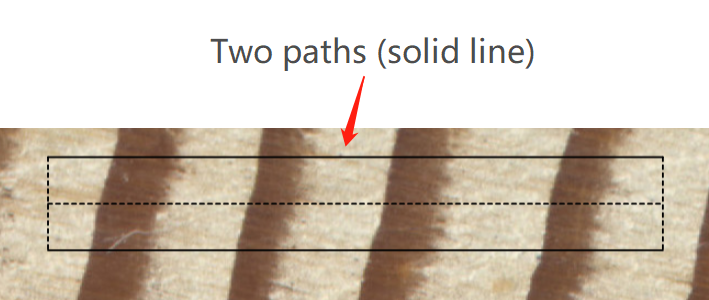

<!--require(knitr);require(markdown);knit("MtreeRing_vignette.Rmd")-->

The following command could run a Shiny-based application within the system's default web browser. The app provides a beginner-friendly graphical interface and supports more flexible mouse-based interactions.

```{r eval=FALSE}
MtreeRing::ring_app_launch()
```


## 1. Image upload

Once you launch the app, you can upload tree ring images from local hard disk. A sample image, named `001.png`, with the resolution of 1200 dpi can be found in the library directory where you install the package. It can also be downloaded from a GitHub repository (https://github.com/ropensci/MtreeRing/raw/master/inst/001.png). In the following sections, this image is used to demonstrate the ring-width measurement. 

You can upload an image with the following steps:

1. When you start the app, click on the **Image Loading** button in the sidebar (It defaults to this page).

2. Click on the **Browse...** button in the **Image Upload** window.

3. Choose an image from hard disk.

4. Click on the **Load** button.

5. Rotate and crop the image (Optional).

    Note that the bark side should be placed on the left side of the graphical window. When cores are scanned side by side, crop the image to remove unwanted cores and unnecessary objects (such as wooden mounts). The subsequent analysis will be performed within the cropped area.
    
    `MtreeRing` app allows for file sizes up to 150 MB. Although this app supports image cropping, the use of extremely large image files is not recommended. A tree-ring image should not contain irrelevant or redundant features (e.g., wooden mounts where cores are glued). Because such a file will consume unnecessary memory space and the subsequent image rendering will also spend too much time. 
    
    A recommended dpi value is in the range of 800 to 2540 (1200 or higher for dendrochronology), as a compromise between the measurement accuracy and computer performance.
    
## 2. Path creation

After image uploading, you can click on the **Measurement** button in the sidebar, and it switches content in the main body. The new page has a graphics window named **Main Window**. This graphics window constitutes the core of MtreeRing. It enables the display of path, detected tree rings, and different types of user-defined markers.

A path creation consists of the following steps:

1. Enter valid path information, including Series ID, DPI and Sampling year.
  
    The series ID is a string with a maximum length of 6 characters. For example, it can be "ZYX011" which indicates the site "ZYX", tree 01 and core 1. For more details on how to name a ring-width series, see **read.ids** in the reference manual of R package **dplR**.

2. Choose the desired path mode. 

    Paths are made of one or more line segments and can have any desired direction. A path is usually placed at the center of the core sample and is adjustable both in width and color. Tree rings are identified along the path. `MtreeRing` app provides three path modes: 

+ **A. Singe Segment**

    This is the default path mode. If the box **Horizontal path** is checked (default), a path is placed along the horizontal direction of the graphics window. To create a path in any direction, uncheck the box **Horizontal path**. See this example:

<center></center>

+ **B. Singe Segment with width correction**

    When **Horizontal path** is checked, you can check the box **Inclined tree rings**. In that case, two parallel paths will be created and you can mark two ring borders on the same ring.
    
    The line segment connecting two dots on the same ring should match the tangent of a tree ring border. Corrected ring widths are estimated from the distance between adjacent rings and orientation of ring borders. 
    
<center></center>

+ **C. Multi Segments**
     
    A Multi-segment path is made of two or more connected line segments (up to 10). When creating paths, their orientation can change from one segment to another at their junction, and should match the direction of wood growth.

<center></center>

3. Create path(s) with mouse clicks

    1) Once you have chosen the desired path mode, move the mouse to **Working mode selector** in the top left corner of the **Main Window** and click the **Path Creation** button.
    
    2) For a single-segment path, move the mouse to the bark side and **double click** the left mouse button once to add a beginning point of the path. `MtreeRing` app will display this point. Then, move the mouse right and **double click** once to add an ending point of the path.
    
        If you create a horizontal single-segment path, the ending point you click will be moved automatically so that it has the same y-coordinate as the beginning point.
    
    3) For a multi-segment path, the ending point of the previous segment is used as the beginning point of the next segment. Just repeat the previous step.
    
    4) Introduction to path creation options:
      
        **Remove Last**: Remove the last endpoint added.
        
        **Remove All**: Remove all endpoints of the path. If you click on this button, you need to re-create a new path.
        
        **Show the preview path**: When you move the mouse over the image, a preview path is drawn with dotted lines. It may help you create a path which follows the growth direction.
    
    5) When you have added all endpoints, a pop-up window appears stating the path creation has been completed successfully.

## 3. Ring detection

If ring borders are clearly visible, follow the steps below to detect tree rings:

1. Click on the **Ring Detection** button next to the **Path Creation** button. 

2. Set detection parameters.

    Automatic detection parameters can be set in **Detection Options** in the top right corner of the app. This box provides a series of input controls for image processing, such as morphological operators and different approaches to edge detection.
    
    If you are not familiar with image processing techniques, use the default settings.

3. Click on the green "**Run Detection**" button. 
    
    The app will detect ring borders along the path. Detected ring borders are tagged with years and border numbers.

## 4. Edit tree rings

If non-edge pixels are incorrectly detected as ring borders, or the wood sample is not suitable for automatic detection, you may need to mark tree rings manually. To switch to the ring editing mode, click on the **Ring Editing** button next to the **Path Creation** button. 

### 4.1 Add tree rings

In the ring editing mode, you can add a ring by **double clicking** on the path. 

See this example:

 

### 4.2 Remove tree rings

Let's start by introducing a mouse action. The Shiny-based app provides a mouse event, called "**brush**". You can select certain portions of the image by left-clicking the mouse button and dragging the mouse over the graphics window. This action will create a blue rectangle. Here is an example of **brush**.

 

Follow these steps to remove tree rings: 

1. Create a rectangular region on the image by brushing.

2. Click on the red "**Delete Border**" button at the top left corner of the **Main Window**.

    This operation will delete all ring borders covered by the rectangular region. 

See this example:

 

You can also perform a mass deletion of borders using the input control below the **Main Window**.

## 5. File download

When the analysis of a sample is complete, you can generate a preview ring-width series by clicking on the blue "**Generate Series**" button at the bottom right corner of the app. 

To download a file, click on the **RWL** tab or **CSV** tab. You can provide additional **headers** for the RWL file to record more useful information, such as species, elevation, and site. 


