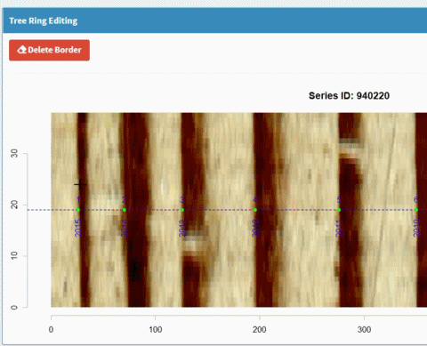

<!--require(knitr);require(markdown);knit("MtreeRing_vignette.Rmd")-->

The following command could run a Shiny-based application within the system's default web browser. The app provides a beginner-friendly graphical interface and supports more flexible mouse-based interactions.

```{r eval=FALSE}
MtreeRing::ring_app_launch()
```


## 1. Image upload

Once you launch the app, you can upload tree ring images from local hard disk. [Here](inst/001.png) is a sample image with the resolution of 1200 dpi. In the following sections, this image is used to demonstrate the ring-width measurement. 

## 2. Path creation

After image loading, you can click on the "**Measurement**" button in the sidebar, and it switches content in the main body. The new page has two graphical windows, named **Tree Ring Detection** and **Tree Ring Editing**. These two graphical windows constitute the core of MtreeRing and enable the display of detected tree rings and different types of user-defined markers.

A path creation consists of the following steps:

1. Enter valid path information, including Series ID, DPI, Sampling year and Y-coordinate of the path.

2. Click on the blue "**Create Path**" button at the top left corner of the **Tree Ring Detection**.

See this example:

 

In the current version, the path is a horizontal dashed line (see Figure 1 above). The path is usually placed at the center of the core sample and is adjustable both in width and color.

## 3. Ring detection

Let's start by introducing a new action. The Shiny-based app provides a mouse event, called "**brush**". You can select certain portions of the image by left-clicking the mouse button and dragging the mouse over the graphical window. This action will create a blue rectangle. Here is an example of **brush**.


 

If ring borders are clearly visible, follow the steps below to detect tree rings:

1. Click on the "**Automation**" button (if this button is not selected). 

    After clicking on this button, `MtreeRing` will show a new box at the top right corner of the app. This box provides a series of input controls for image processing, such as morphological operators and different approaches to edge detection.

2. Create a blue rectangle mentioned above in the first graphical window (**Tree Ring Detection**) by brushing.

3. Click on the green "**Run Detection**" button. 
    
    The app will detect ring borders within the rectangular region. Detected ring borders are placed along the path, and are tagged with years and border numbers. We suggest creating a narrow rectangle to accelerate the detecting process. 

See this example:


 

## 4. Edit tree rings

If non-edge pixels are incorrectly detected as ring borders, or the wood sample is not suitable for automatic detection, you may need to mark tree rings manually. In this case, the second graphical window (**Tree Ring Editing**) is used to add (remove) tree ring borders to (from) the image.

You may have noticed that the graphical windows **Tree Ring Editing** has no image. To generate a zoomed-in image in this windows, follow these steps:

1. Create a blue rectangle in the **Tree Ring Detection** by brushing.

2. **Double click** on this rectangle, or Click on the blue "**Create Sub-image**" button below.

### 4.1 Add tree rings

After creating the zoomed-in image, you can add a ring by **double clicking** on the path. 

See this example:

 

### 4.2 Remove tree rings

Follow these steps to remove tree rings: 

1. Create a rectangle in the **Tree Ring Editing** by brushing.

2. Click on the red "**Delete Border**" button at the top left corner of the **Tree Ring Editing**.

    This operation will delete all ring borders covered by the rectangular region. 

See this example:

 

You can also perform a mass deletion of borders using the input control below the **Tree Ring Editing**.

## 5. File download

When the analysis of a sample is complete, you can generate a preview ring-width series by clicking on the blue "**Generate Series**" button at the bottom right corner of the app. 

To download a file, click on the **RWL** tab or **CSV** tab. You can provide additional **headers** for the RWL file to record more useful information, such as species, elevation, and site. 

## 6. Run Shiny app

If you are not familiar with R and its command line interface, the shiny-based app is a good alternative. 

A workflow for the Shiny app can be found in the README file of this package. Most steps are demonstrated with a gif to make the workflow more understandable. Here is a link: https://github.com/JingningShi/MtreeRing.

```{r eval=FALSE}
ring_app_launch()
```


