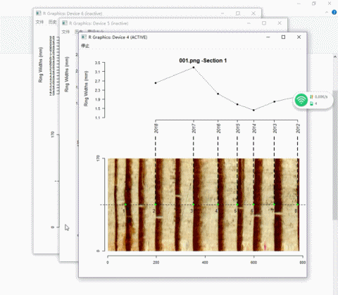

<!--require(knitr);require(markdown);knit("MtreeRing_vignette.Rmd")-->

`MtreeRing` is a tool for automatically measuring tree-ring width using image processing techniques. The procedure of automatic detection of ring borders consists of the following steps： 

## 1. Read and plot a tree ring image

```{r eval=FALSE}
library(MtreeRing)
img.name <- system.file("001.png", package = "MtreeRing")
t1 <- ring_read(img = img.name, dpi = 1200, plot = TRUE)
```

`ring_read` supports commonly used image formats, including png, tiff, jpg and bmp.


## 2. Detect ring borders 

`ring_detect` is the most important funtion in `MtreeRing`. It is used to automatically detect tree-ring borders along the user-defined path. The automatic detection can be performed using three alternative methods: (1) watershed algorithm; (2) Canny edge detector; (3) a linear detection algorithm from R package [measuRing](https://CRAN.R-project.org/package=measuRing).

```{r eval=FALSE}
## Split a long core sample into 2 pieces to
## get better display performance and use the
## watershed algorithm to detect ring borders:
t2 <- ring_detect(ring.data = t1, auto.path = TRUE, seg = 2, method = 'watershed')
```

If `auto.path = TRUE`, `ring_detect` will create a path at the center of the image. In the current version, the path is a horizontal dashed line. Detected ring borders are placed along the path, and are tagged with years and border numbers.

  

For increment cores with inclined rings, you can create two paths by setting `incline = TRUE`. The distance between adjacent rings and orientation of ring borders are used to correct the ring-width series.

```{r eval=FALSE}
img.name <- system.file("incline.png", package = "MtreeRing")
t1 <- ring_read(img = img.name, dpi = 1200)
t2 <- ring_detect(ring.data = t1, incline = TRUE, method = 'watershed')
```


## 3. Edit tree rings

You can manually add (remove) tree ring borders to (from) the image using the function `ring_modify`.

### 3.1 Remove tree rings

Assume that ring borders numbered from 1 to 4 were falsely identified as transitions between earlywood and latewood. Try to remove them with the following commands.

```{r eval=FALSE}
img.name <- system.file("001.png", package = "MtreeRing")
t1 <- ring_read(img = img.name, dpi = 1200)
t2 <- ring_detect(ring.data = t1, auto.path = TRUE, method = 'watershed')
t2 <- ring_modify(ring.data = t2, del = c(1:4))
```

### 3.2 Add tree rings

We have just removed 4 ring borders, now re-add these borders by left-clicking on the image.

```{r eval=FALSE}
t2 <- ring_modify(ring.data = t2, add = TRUE)
```

If `add = TRUE`, graphics windows opened by `ring_detect` will be activated sequentially. When a graphics window is activated, you can add new borders by left-clicking the mouse along the path. Every click draws a point representing the ring border. The identification process does not automatically stop by itself.

  1. On the Windows system, the identification process can be terminated by pressing the right mouse button and selecting **Stop** from the menu.
  
  2. On the MacOS system, for a X11 device the identification process is terminated by pressing any mouse button other than the first, and for a quartz device this process is terminated by pressing the **ESC** key.
  
Once you terminate an identification process, the current graphics window will be closed automatically, and the graphics window of the following segment is activated.

Here is an example of adding ring borders on Windows system:



## 4. Calculate ring-width series 

If all ring borders are correctly identified, you can generate a ring-width series in data frame format. Use `write.rwl` to export the ring-width series to an rwl file.

```{r eval=FALSE}
rw.df <- ring_calculate(ring.data = t2, seriesID = "940220")
library(dplR) # A dendrochronological analysis package
fn <- tempfile(fileext=".rwl")
write.rwl(rwl.df = rw.df, fname = fn, format = "tucson")
```

