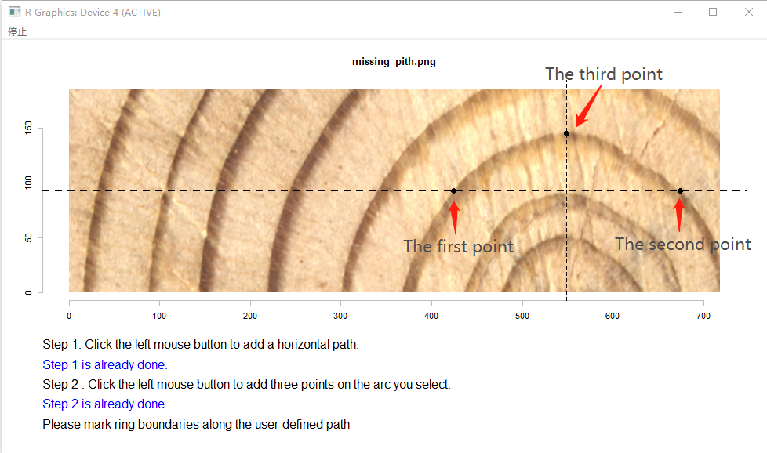

<!--require(knitr);require(markdown);knit("MtreeRing_vignette.Rmd")-->

It is common for increment cores to miss the pith. Under such conditions, errors associated with inclined rings can be corrected using the arcs of the inner-rings (Duncan, 1989).

For wood samples with missing pith, the function `pith_measure` is used to estimate the position of missing pith and measure tree rings on the pith side. It is **strongly recommended** to read reference below to get a better understanding of `pith_measure`. The procedure of ring-width correction consists of the following steps：

## 1. Add a path

```{r eval=FALSE}
img.name <- system.file("missing_pith.png", package = "MtreeRing")
t1 <- ring_read(img = img.name, dpi = 1200)
# Assume that the wood sample misses the pith
t2 <- pith_measure(ring.data = t1, inner.arc = TRUE, last.yr = 2016)
```

Once you call `pith_measure`, you are prompted to add a path. You need to click on the image once, then a horizontal dashed line passing through the mouse cursor will be plotted. The path should traverse an appropriate arc (read the reference for more details). See this example.


## 2. Locate the missing pith

After creating the path, you are prompted to add three points. Every click draws a point. These points are used to locate the missing pith. The first point should be placed on the left endpoint of the arc, and the second point is placed on the right endpoint.

After adding these two points, a vertical dashed line will be plotted automatically according to the (x,y) positions of endpoints you just added. The third points should be placed on the intersection of the vertical dashed line and the selected arc. See this example.



## 3. Mark tree rings along the path

You will be prompted to mark tree rings along the path by left-clicking on the image. Every click draws a point. The identification process does not automatically stop by itself. The termination of identification process depends on the R version. 

  1. On the Windows platform, the identification process can be terminated by clicking the second button and selecting ‘Stop’ from the menu.  
  
  2. On the MacOS system, you can press the **Escape** key to terminate the identification process

Note that the left endpoint of the arc will be considered as the last ring border without the need to mark it. Once you terminate the identification process, ring borders will be tagged with years or border numbers.


The measurements units are millimeters. Let's look at what we get: 

```{r eval=FALSE}
> print(t2)
  year original.width corrected.width
1 2015           1.57            1.54
2 2014           1.17            1.14
3 2013           1.72            1.65
4 2012           2.05            1.90
5 2011           1.70            1.45
```

## Reference

Duncan R. (1989) An evaluation of errors in tree age estimates based on increment cores in Kahikatea (Dacrycarpus dacrydiodes). *New Zealand Natural Sciences* **16(4)**, 1-37.

